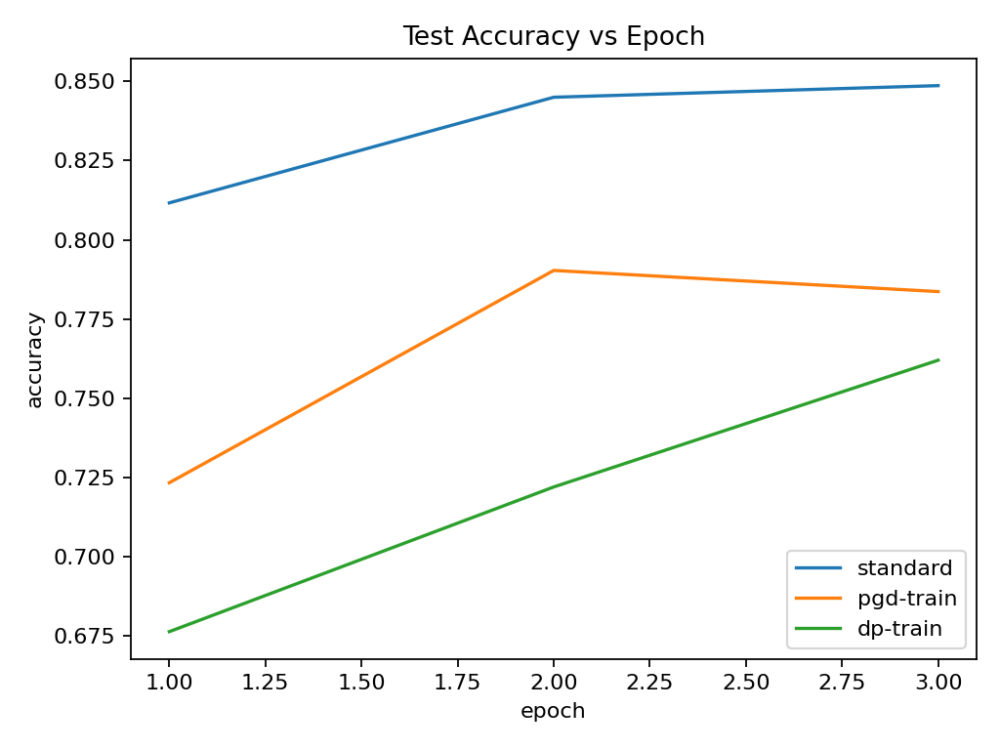
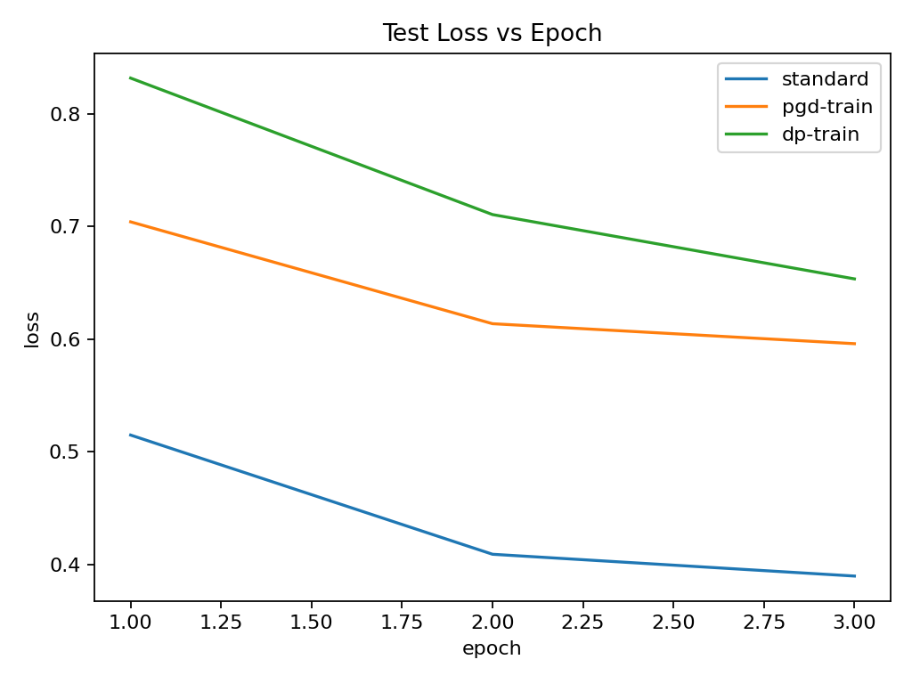
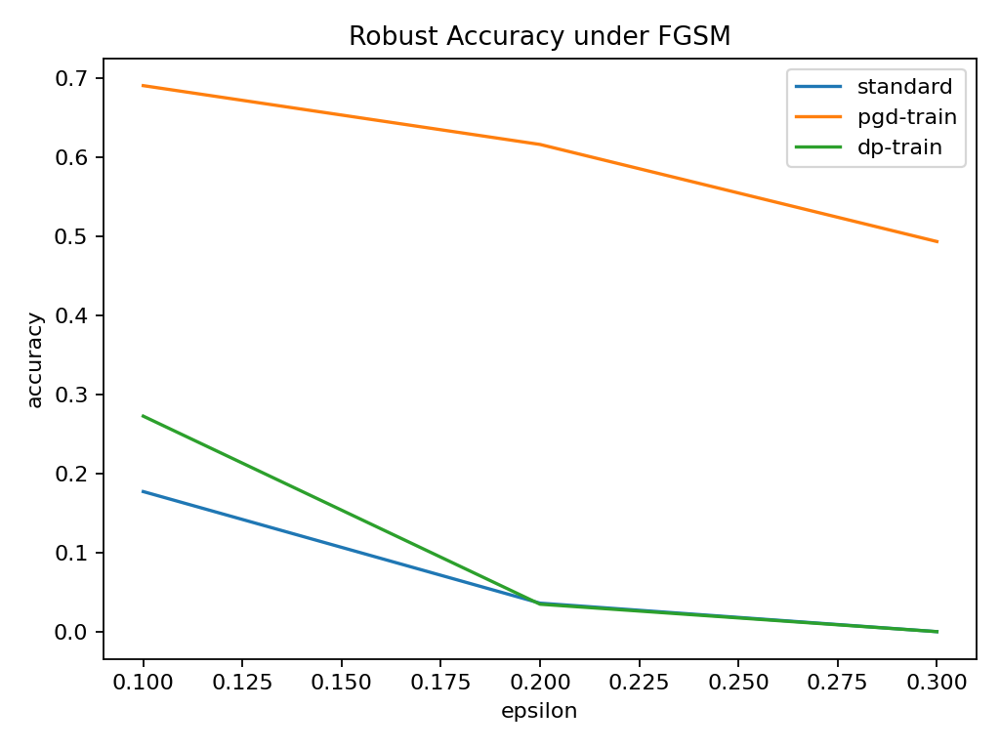
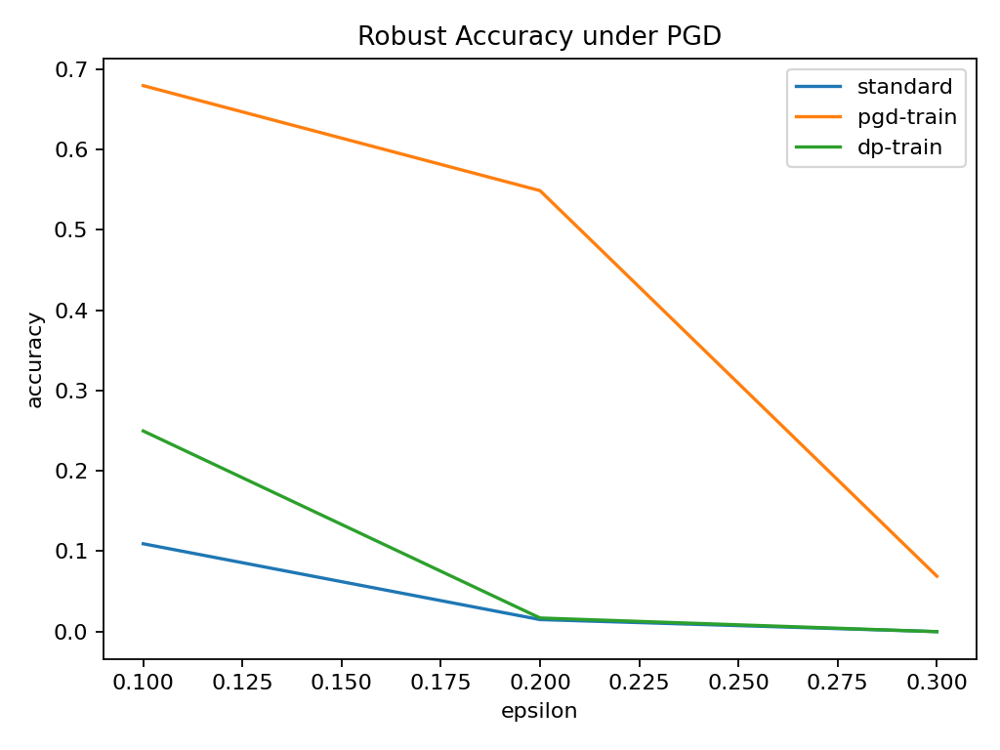
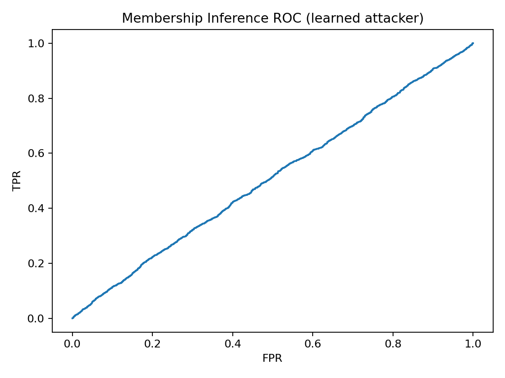
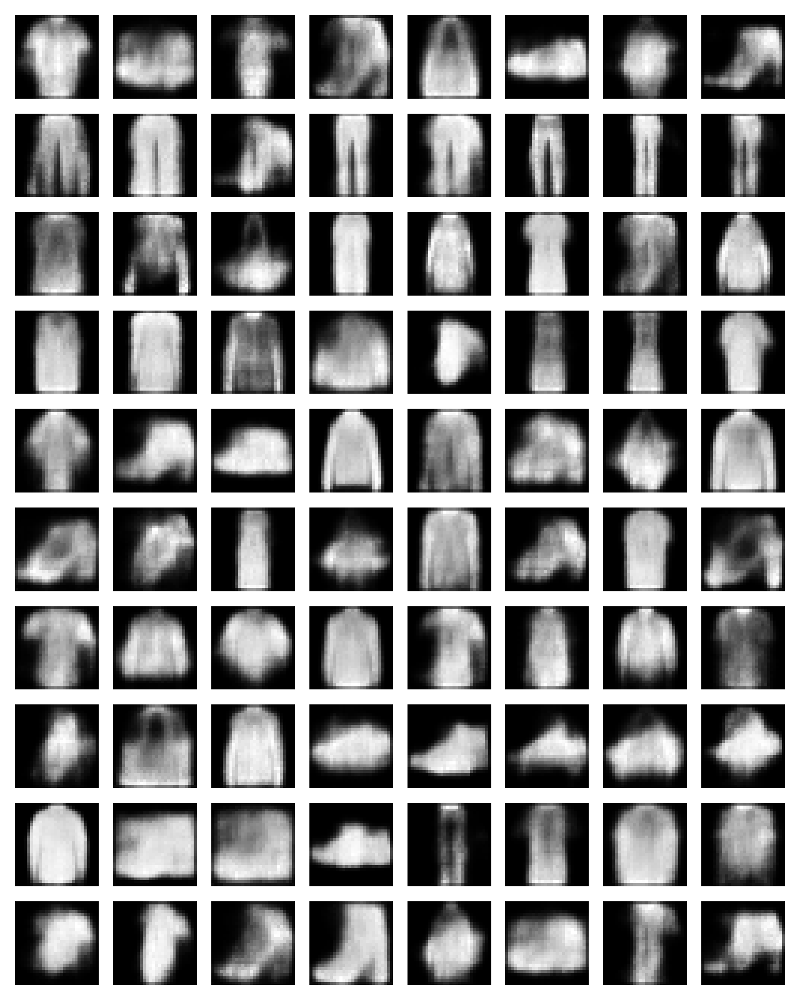
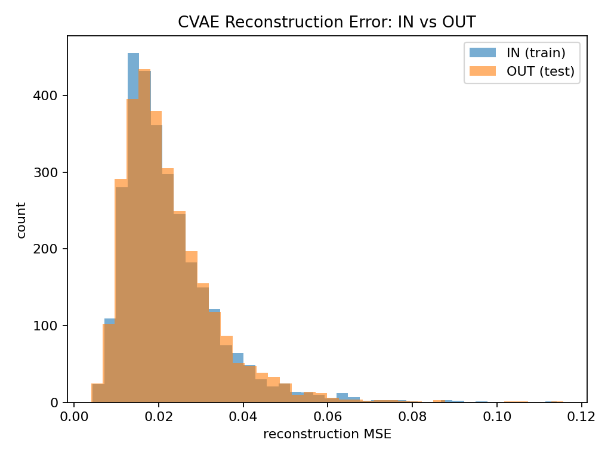

# Unified ML Security & Privacy Lab (FashionMNIST)
**A research-style benchmark of the Utility–Robustness–Privacy trade-off across discriminative and generative models**

It trains multiple model variants, evaluates **adversarial robustness** under standard threat models, and quantifies **privacy leakage** via **membership inference attacks**, while also incorporating **generative modeling** and a **classical EM baseline** for comparison.

---

## Why this project matters
Modern ML systems must balance three competing goals:

- **Utility**: high accuracy on clean data  
- **Robustness**: resilience to adversarial perturbations (FGSM/PGD)  
- **Privacy**: limiting information leakage about training data membership (MIA)

This repo provides a clean, reproducible way to measure these trade-offs end-to-end.

---

## Methods (what’s implemented)

### 1) Discriminative models (CNN)
A compact CNN is trained under three regimes:
- **Standard ERM training**
- **PGD adversarial training** (robust optimization)
- **DP-style training baseline** (gradient clipping + Gaussian noise; *empirical only, no ε/δ accounting*)

### 2) Robustness evaluation
Robust accuracy is measured against:
- **FGSM (ℓ∞)**
- **PGD (ℓ∞)**

Robustness curves are generated for multiple ε values.

### 3) Privacy evaluation (Membership Inference Attacks)
Two attacks are implemented:
- **Threshold attacker** (based on correctness)
- **Learned attacker** (logistic regression trained on shadow-model features such as loss/confidence/entropy)

### 4) Generative modeling + privacy probe (CVAE)
A **Conditional VAE** is trained on FashionMNIST to:
- generate class-conditional samples
- test whether **reconstruction error** separates **IN (train)** vs **OUT (test)** points (a reconstruction-based membership signal)

### 5) Classical generative baseline (GMM + EM)
A diagonal-covariance **Gaussian Mixture Model (EM from scratch)** is trained per class (on PCA features), forming a plug-in Bayes classifier baseline.

---

## Key results (your run: GPU, `quick_mode=true`)

### Clean performance (utility)
| Model | Test Acc | Test Loss |
|---|---:|---:|
| **Standard CNN** | **0.8487** | 0.3897 |
| PGD-trained CNN | 0.7837 | 0.5959 |
| DP-style CNN (noisy gradients) | 0.7620 | 0.6534 |
| **GMM (diag EM + PCA features)** | 0.7860 | — |

**Interpretation:** standard training maximizes clean accuracy; robustness- and privacy-motivated training introduces a utility cost. The classical GMM baseline is competitive, strengthening the discriminative-vs-generative comparison.

---

### Robust accuracy under attack (robustness)

**FGSM robust accuracy**
| ε | Standard | **PGD-trained** | DP-style |
|---:|---:|---:|---:|
| 0.1 | 0.1773 | **0.6903** | 0.2727 |
| 0.2 | 0.0363 | **0.6160** | 0.0350 |
| 0.3 | 0.0003 | **0.4933** | 0.0003 |

**PGD robust accuracy**
| ε | Standard | **PGD-trained** | DP-style |
|---:|---:|---:|---:|
| 0.1 | 0.1093 | **0.6793** | 0.2497 |
| 0.2 | 0.0150 | **0.5487** | 0.0170 |
| 0.3 | 0.0000 | **0.0690** | 0.0000 |

**Interpretation:** PGD adversarial training substantially improves robustness across ε, especially at ε=0.1–0.2, while standard and DP-style models degrade rapidly as perturbations increase.

---

### Membership inference (privacy leakage)
(AUC ≈ 0.5 means near-random guessing)

| Target model | Threshold acc | Learned acc | Learned AUC |
|---|---:|---:|---:|
| Standard CNN | 0.5107 | 0.5120 | 0.5151 |
| PGD-trained CNN | 0.5052 | 0.5023 | 0.5000 |
| DP-style CNN | 0.5030 | 0.5100 | 0.5101 |

**Interpretation:** Under the current quick-mode configuration, the attacker is near-random (AUC ≈ 0.50–0.52). This is common when the attacker is underpowered (few shadow models, short training). The pipeline is designed so you can strengthen the attack and re-measure leakage trends.

---

### CVAE reconstruction membership signal
- **Recon gap (OUT − IN):** `5.83e−05` (small)
- IN vs OUT reconstruction error distributions overlap strongly.

**Interpretation:** In this run, reconstruction error does not meaningfully separate members vs non-members; further training or alternate generative objectives can be explored as extensions.

---

## How to run

### Install
```bash
pip install -r requirements.txt
```

### Quick run (fast sanity check)
```bash
python -m src.main --quick
```

### Stronger run (recommended for “final” numbers)
```bash
python -m src.main --epochs 10 --cvae_epochs 20 --shadow_models 5
```

---

## Outputs
All artifacts are written to `results/`:

### Training Curves
| Test Accuracy | Test Loss |
|:---:|:---:|
|  |  |

### Robustness Evaluation
| FGSM Attack | PGD Attack |
|:---:|:---:|
|  |  |

### Privacy & Generative Models
| MIA ROC Curve | CVAE Samples | CVAE Reconstruction |
|:---:|:---:|:---:|
|  |  |  |

- `summary.json` — full metric dump (clean, robust, privacy, CVAE, GMM)

---

## Repo structure
```
src/
  main.py        # end-to-end experiment runner + plotting + summary.json writer
  data.py        # FashionMNIST loaders + helpers
  models.py      # SmallCNN + CVAE
  train.py       # ERM, adversarial training, DP-style training, evaluation
  attacks.py     # FGSM + PGD
  mia.py         # membership inference features + shadow attacker
  gmm_em.py      # diagonal GMM EM implementation + log-likelihood
results/
```


---

## Notes / limitations (important for correctness)
- **DP-style training is empirical only**: it adds gradient clipping + Gaussian noise but does **not** provide formal (ε, δ) accounting.
- **MIA strength depends on configuration**: increasing shadow models and training epochs typically yields a stronger attacker and more informative leakage estimates.

---

## Suggested extensions (to elevate to “mini-research”)
- Replace the DP-style baseline with **Opacus DP-SGD** and report (ε, δ) vs accuracy/leakage.
- Add a **GAN-based synthetic-data arm** and compare privacy leakage from CVAE vs GAN synthetic samples.
- Expand attacker features (full logits, per-example gradients, or confidence trajectories).

---

## License
Add your preferred license (e.g., MIT) before publishing.
